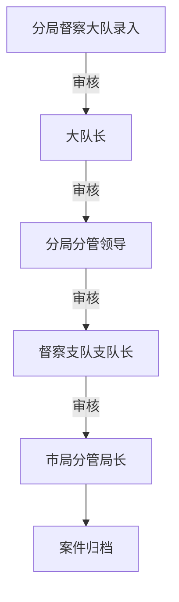
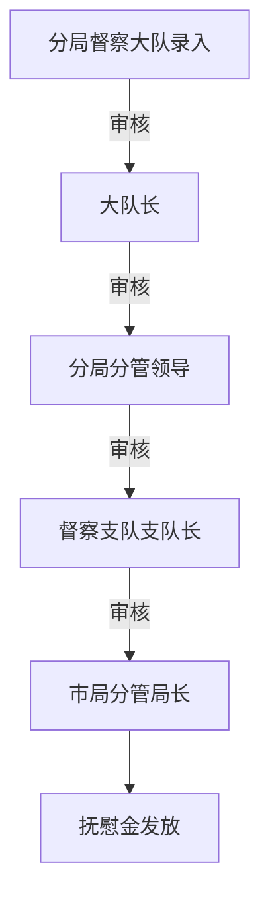

好的，我会在流程图中标注不同角色（单位或人）的操作步骤。

### 案件管理流程图

```mermaid
graph TD
    A[分局督察大队录入] -->|审核| B[大队长]
    B -->|审核| C[分局分管领导]
    C -->|审核| D[督察支队支队长]
    D -->|审核| E[市局分管局长]
    E --> F[案件归档]
```

### 抚慰金流程图

```mermaid
graph TD
    A[分局督察大队录入] -->|审核| B[大队长]
    B -->|审核| C[分局分管领导]
    C -->|审核| D[督察支队支队长]
    D -->|审核| E[市局分管局长]
    E --> F[抚慰金发放]
```

<!--stackedit_data:
eyJoaXN0b3J5IjpbNTA5MzcxNjEzXX0=
-->