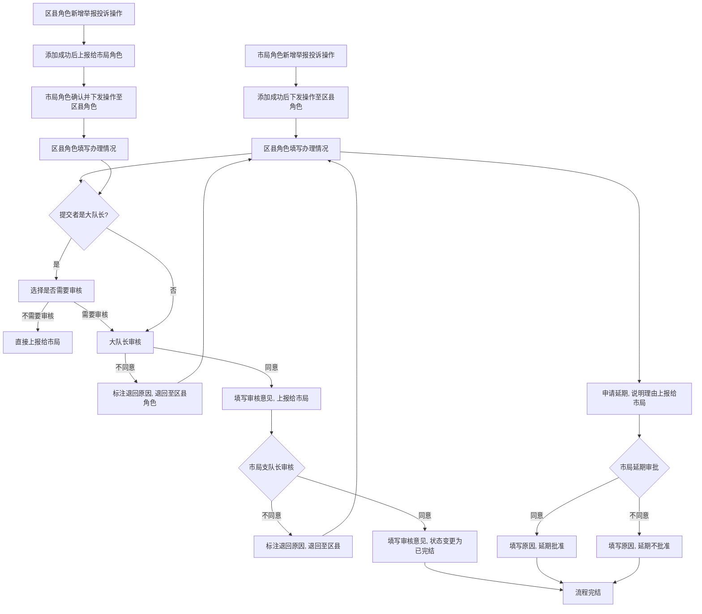

```mermaid
graph TD;
    A[市局角色新增举报投诉操作] --> B[添加成功后下发操作至区县角色];
    B --> C[区县角色填写办理情况];
    C --> D{提交者是大队长?};
    D -- 是 --> E[选择是否需要审核];
    E -- 不需要审核 --> F[直接上报给市局];
    E -- 需要审核 --> G[大队长审核];
    D -- 否 --> G;
    G -- 不同意 --> H[标注退回原因, 退回至区县角色];
    G -- 同意 --> I[填写审核意见, 上报给市局];
    H --> C;
    I --> J{市局支队长审核};
    J -- 不同意 --> K[标注退回原因, 退回至区县];
    J -- 同意 --> L[填写审核意见, 状态变更为已完结];
    K --> C;
    L --> M[流程完结];
    C --> N[申请延期, 说明理由上报给市局];
    N --> O{市局延期审批};
    O -- 同意 --> P[填写原因, 延期批准];
    O -- 不同意 --> Q[填写原因, 延期不批准];
    P --> M;
    Q --> M;

    R[区县角色新增举报投诉操作] --> S[添加成功后上报给市局角色];
    S --> T[市局角色确认并下发操作至区县角色];
    T --> U[区县角色填写办理情况];
    U --> D;

```
<!--stackedit_data:
eyJoaXN0b3J5IjpbLTEwMzA3MTQ4NTcsMTIyNzcxMTQwNF19
-->