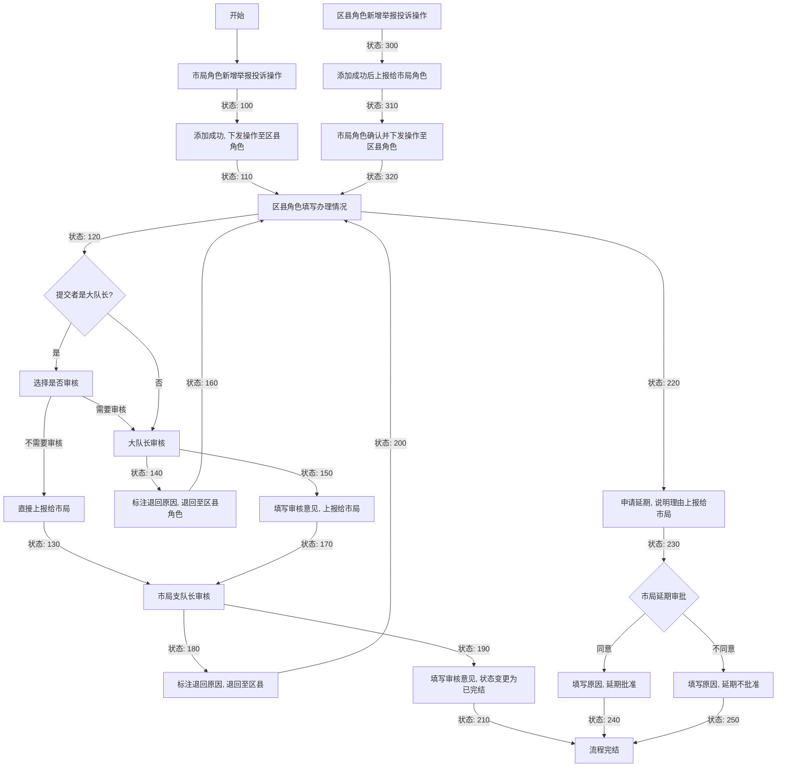

```mermaid
graph TD;
    A[开始] --> B[市局角色新增举报投诉操作]
    B -->|状态: 100| C[添加成功, 下发操作至区县角色]
    C -->|状态: 110| D[区县角色填写办理情况]
    D -->|状态: 120| E{提交者是大队长?}
    E -->|是| F[选择是否审核]
    F -->|不需要审核| G[直接上报给市局]
    G -->|状态: 130| L[市局支队长审核]
    F -->|需要审核| H[大队长审核]
    E -->|否| H
    H -->|状态: 140| I[标注退回原因, 退回至区县角色]
    H -->|状态: 150| J[填写审核意见, 上报给市局]
    I -->|状态: 160| D
    J -->|状态: 170| L
    L -->|状态: 180| M[标注退回原因, 退回至区县]
    L -->|状态: 190| N[填写审核意见, 状态变更为已完结]
    M -->|状态: 200| D
    N -->|状态: 210| O[流程完结]
    D -->|状态: 220| P[申请延期, 说明理由上报给市局]
    P -->|状态: 230| Q{市局延期审批}
    Q -->|同意| R[填写原因, 延期批准]
    Q -->|不同意| S[填写原因, 延期不批准]
    R -->|状态: 240| O
    S -->|状态: 250| O

    T[区县角色新增举报投诉操作] -->|状态: 300| U[添加成功后上报给市局角色]
    U -->|状态: 310| V[市局角色确认并下发操作至区县角色]
    V -->|状态: 320| D


```
<!--stackedit_data:
eyJoaXN0b3J5IjpbLTE3MTA5MTg4MjksMjg4NjY3MDgxLC0xMD
MwNzE0ODU3LDEyMjc3MTE0MDRdfQ==
-->