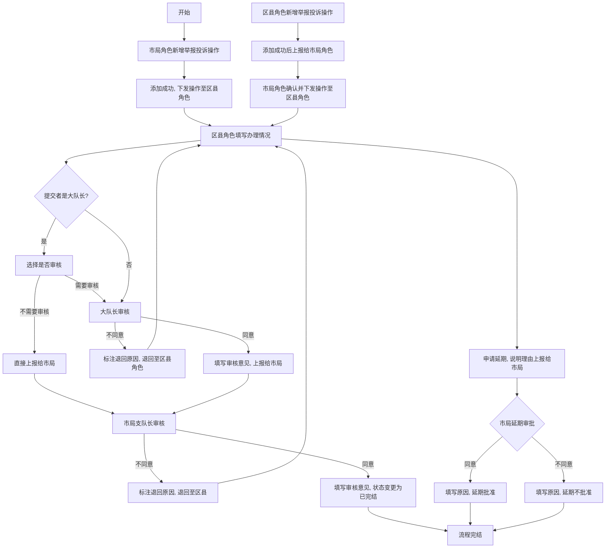

```mermaid
graph TD;
    A[开始]
    A --> B[市局角色新增举报投诉操作]
    B --> C[添加成功, 下发操作至区县角色]
    C --> D[区县角色填写办理情况]
    D --> E{提交者是大队长?}
    E -->|是| F[选择是否审核]
    F -->|不需要审核| G[直接上报给市局]
    G --> L[市局支队长审核]
    F -->|需要审核| H[大队长审核]
    E -->|否| H
    H -->|不同意| I[标注退回原因, 退回至区县角色]
    H -->|同意| J[填写审核意见, 上报给市局]
    I --> D
    J --> L
    L -->|不同意| M[标注退回原因, 退回至区县]
    L -->|同意| N[填写审核意见, 状态变更为已完结]
    M --> D
    N --> O[流程完结]
    D --> P[申请延期, 说明理由上报给市局]
    P --> Q{市局延期审批}
    Q -->|同意| R[填写原因, 延期批准]
    Q -->|不同意| S[填写原因, 延期不批准]
    R --> O
    S --> O

    T[区县角色新增举报投诉操作] --> U[添加成功后上报给市局角色]
    U --> V[市局角色确认并下发操作至区县角色]
    V --> D


```
<!--stackedit_data:
eyJoaXN0b3J5IjpbMjg4NjY3MDgxLC0xMDMwNzE0ODU3LDEyMj
c3MTE0MDRdfQ==
-->